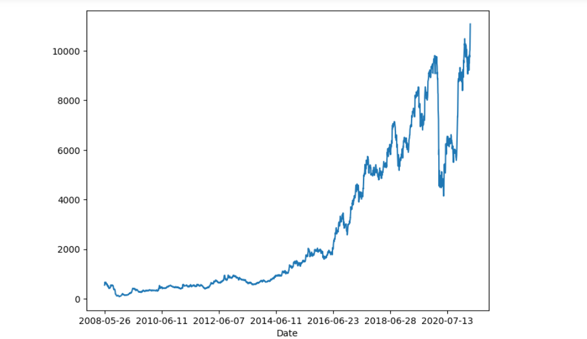
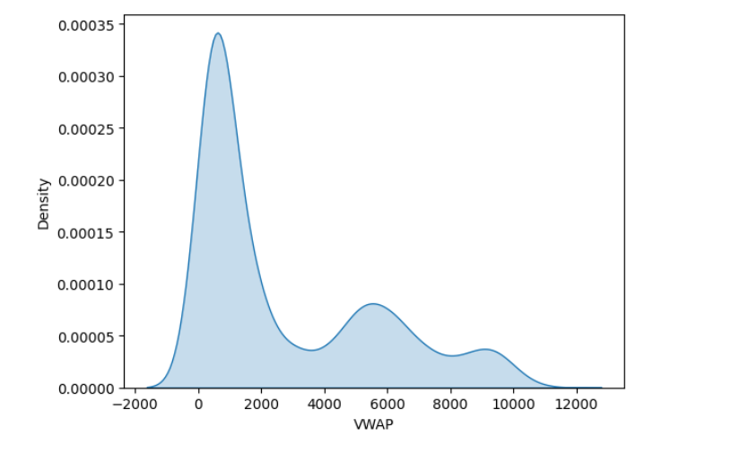
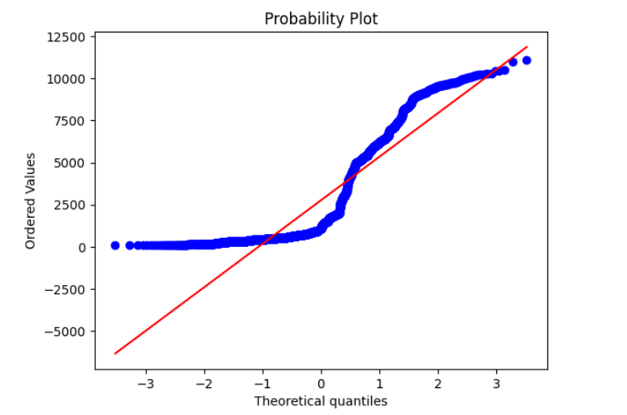
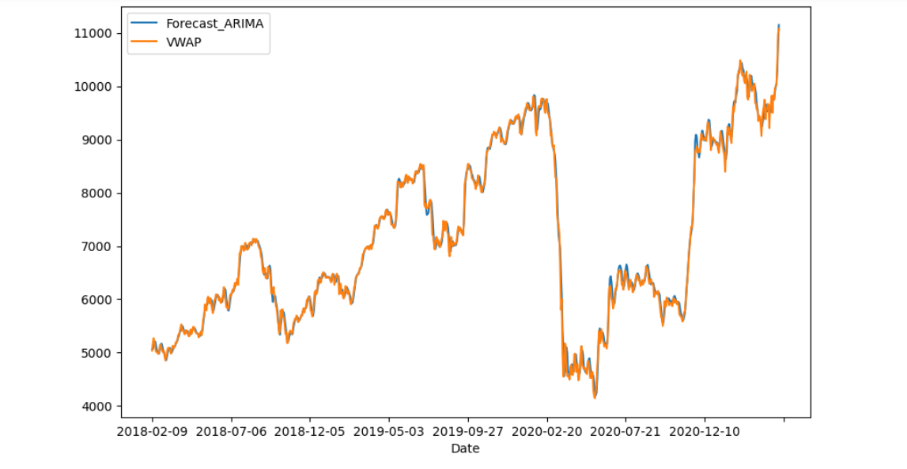

HEAD
# Time Series Stock Price Analysis & Forecasting

## Overview
This project focuses on analyzing and forecasting stock price movements using classical time-series analysis techniques. The objective is to understand historical trends, volatility patterns, and temporal dependencies in stock price data, and to build predictive models that estimate future price behavior.

## Problem Statement
Stock prices exhibit time-dependent patterns influenced by market dynamics, trends, and volatility. Accurately modeling these behaviors supports forecasting, risk analysis, and data-driven investment decision-making. This project applies statistical time-series methods to analyze and forecast stock price trends.

## Dataset
- Historical stock price data including Open, High, Low, Close, and Weighted Average Price (WAP)
- Time-indexed daily observations
- Data sourced from publicly available financial market data

## Approach
The project follows an end-to-end time-series workflow:
- Data ingestion and preprocessing
- Handling missing values and date-time indexing
- Exploratory data analysis to identify trends, volatility, and distributional properties
- Time-series decomposition and stationarity checks
- Model development and evaluation using classical forecasting techniques

## Models & Techniques Used
- Time-series visualization and trend analysis
- Rolling statistics and volatility analysis
- Distribution analysis and normality checks (Q–Q plots)
- Stationarity testing (ADF test)
- ARIMA-based forecasting models
- Model evaluation using error metrics

## Visual Results

### ARIMA Forecast vs Actual
Comparison of ARIMA-based forecasts against actual weighted average price (WAP), illustrating the model’s ability to capture overall trends and short-term movements.
  


### OHLC Price Trends
Time-series visualization of Open, High, Low, and Close prices highlighting long-term growth patterns and market volatility.


### Distribution & Normality Analysis
Analysis of price distribution characteristics and deviations from normality.

**Q–Q Plot**


**WAP Density Distribution**


**WAP Histogram**


### Long-Term Price Trend
Visualization of long-term stock price behavior, including growth phases, drawdowns, and recovery periods across market cycles.



## Results
- Identified long-term trends and short-term fluctuations in stock prices
- Observed non-normal and multi-modal price distributions
- Demonstrated ARIMA model effectiveness in short-term forecasting
- Highlighted volatility patterns and structural shifts over time

## Tools & Technologies
- Python
- Pandas, NumPy
- Matplotlib, Seaborn
- Statsmodels
- Jupyter Notebook

## How to Run
1. Clone the repository  
2. Install dependencies:
   ```bash
pip install pandas numpy matplotlib seaborn statsmodels

3.Open the notebook:
jupyter notebook Time_Series_Stock_prices.ipynb


